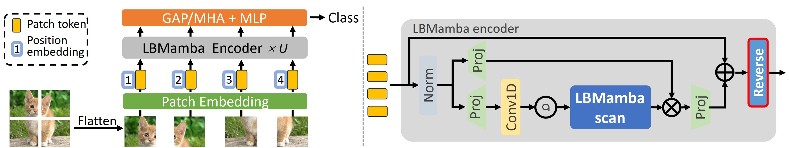
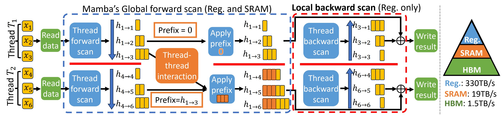

# LBMamba: Locally Bi-directional Mamba [TMLR]
CUDA implementation for the LBMamba kernel and Pytorch implementation for the LBVim framework described in the paper [LBMamba: Locally Bi-directional Mamba](), [arxiv](https://arxiv.org/abs/2506.15976).  

<div>
  
  
</div>

## Installation
Install [Anaconda/miniconda](https://www.anaconda.com/products/distribution).  
Required packages:
```
  $ conda create --name lbmamba python=3.10.13
  $ conda activate lbmamba
  $ conda install pytorch==2.1.1 torchvision==0.16.1 torchaudio==2.1.1 pytorch-cuda=11.8 -c pytorch -c nvidia
  $ conda install cuda -c nvidia/label/cuda-11.8.0
  $ conda install cmake # If you already have cmake, ignore this
  $ pip install -r classification/vim_requirements.txt
  
  $ pip install causal-conv1d==1.1.0
  $ pip install -e mamba-1p1p1/ # in the Vim project, for the original mamba
  
  # For segmentation and detection
  $	pip uninstall mmcv mmsegmentation
  $ pip install -U openmim
  $ mim install mmcv==2.1.0
  $ pip install "mmsegmentation>=1.0.0"
  $ pip install ftfy
  $ mim install mmdet
  $ pip install tensorboard
``` 
The ```mamba-1p1p1``` is located in the [Vim](https://github.com/hustvl/Vim) project. We also provide the output of ```conda list``` and ```pip list``` of our environment in the [env_list](env_list) directory for reference.

## Build LBMamba CUDA kernel
We use CMake to build our CUDA kernel. Please replace the ```-DPython_ROOT_DIR="/home/jzhang/Dev/anaconda3_2023/envs/vim"``` in ```LBMamba_kernel/build.sh``` with your python root directory. E.g. if you use conda environment and your python is located at ```/home/jzhang/Dev/anaconda3_2023/envs/vim/bin/python```, you should set ```-DPython_ROOT_DIR="/home/jzhang/Dev/anaconda3_2023/envs/vim"```. Then run ```bash build.sh```, the compiled pscan.so should appear in ```lbm/pscan_cuda/pscan.so```. You can try to run ```import lbm.pscan_cuda.pscan``` in python to verify if it is correct as follows:
```
 $ cd LBMamba_kernel
 $ bash build.sh
 $ cd ..
 $ python -c "import torch; import lbm.pscan_cuda.pscan" 
```
Note that if use used some pretty new GPUs, e.g. H100, you need to change the ```-DCUDA_ARCHS="70;75;80"``` (```-DCUDA_ARCHS="90"``` for H100) to the corresponding sm version of the GPU. You can check the corresondence [here](https://developer.nvidia.com/cuda-gpus).

## Training
Please refer to our training scripts in [classification/scripts/train.sh](classification/scripts/train.sh). For more usage, please refer to the [Vim](https://github.com/hustvl/Vim) repo.
Our pretrained weights can be downloaded [here](https://github.com/cvlab-stonybrook/LBMamba/releases/tag/v1.0).

## Contact
If you have any questions or concerns, feel free to report an issue or directly contact us at Jingwei Zhang <jingwezhang@cs.stonybrook.edu> and Xi Han <xihan1@cs.stonybrook.edu>. 

## Acknowledgments
Our framework is based on [Vim](https://github.com/hustvl/Vim), [LocalMamba](https://github.com/hunto/LocalMamba), [mamba.py](https://github.com/alxndrTL/mamba.py) and [2DMamba](https://github.com/AtlasAnalyticsLab/2DMamba/). Thanks for their outstanding code.

## Citation
If you use the code or results in your research, please use the following BibTeX entry.  
```
@article{zhang2025lbmamba,
  title={LBMamba: Locally Bi-directional Mamba},
  author={Zhang, Jingwei and Han, Xi and Qin, Hong and Hosseini, Mahdi S and Samaras, Dimitris},
  journal={arXiv preprint arXiv:2506.15976},
  year={2025}
}
```